# Adventure Works — End-to-End Data Engineering using Azure & Power BI

A complete end-to-end data engineering solution built on Microsoft Azure using the **Medallion Architecture** (Bronze → Silver → Gold), with a Power BI dashboard for business reporting and analytics.

---

## Table of Contents

- [Project Overview](#project-overview)
- [Architecture](#architecture)
- [Tech Stack](#tech-stack)
- [Data Ingestion — Bronze Layer](#data-ingestion--bronze-layer)
- [Data Transformation — Silver Layer](#data-transformation--silver-layer)
- [Data Modeling — Gold Layer](#data-modeling--gold-layer)
- [Data Model Summary](#data-model-summary)
- [Power BI Dashboard](#power-bi-dashboard)
- [Key Insights](#key-insights)

---

## Project Overview

This project demonstrates a production-grade data pipeline that ingests raw AdventureWorks datasets from GitHub, transforms and enriches the data through structured layers, and serves it as an analytics-ready model in Power BI.

**Dataset:** AdventureWorks (Sales, Customers, Products, Returns, Territories, Calendar)  
**Source:** GitHub (raw CSV files)  
**Destination:** Azure Data Lake Storage Gen2 → Azure Synapse Analytics → Power BI

---

## Architecture

The pipeline follows the **Medallion Architecture**:

```
GitHub (Raw CSV)
      │
      ▼
┌─────────────────────┐
│   Bronze Layer      │  Raw data ingested as-is (CSV format)
│   ADLS Gen2         │
└─────────────────────┘
      │
      ▼
┌─────────────────────┐
│   Silver Layer      │  Cleaned & transformed data (Parquet format)
│   ADLS Gen2         │  via ADF Mapping Data Flows
└─────────────────────┘
      │
      ▼
┌─────────────────────┐
│   Gold Layer        │  Business-ready external tables (Parquet)
│   Azure Synapse     │  via CETAS in Serverless SQL Pool
└─────────────────────┘
      │
      ▼
┌─────────────────────┐
│   Power BI          │  Star schema model + interactive dashboards
└─────────────────────┘
```

---

## Tech Stack

| Service | Purpose |
|---|---|
| Azure Data Factory (ADF) | Pipeline orchestration & data ingestion |
| Azure Data Lake Storage Gen2 (ADLS) | Raw and transformed data storage |
| ADF Mapping Data Flows | Data transformation (runs on Apache Spark) |
| Azure Synapse Analytics (Serverless SQL) | Gold layer data modeling & querying |
| Power BI | Business intelligence & reporting |

---

## Data Ingestion — Bronze Layer

### Azure Resources Created
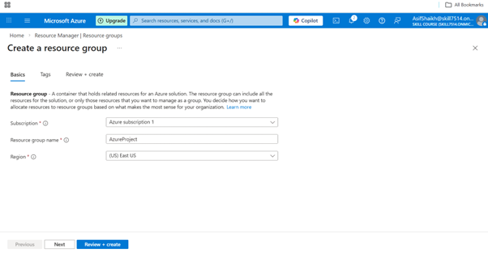
- **Resource Group:** `AzureProject`
- **Storage Account (Data Lake):** `adventureworksdatalakest`
  - Hierarchical Namespace enabled (ADLS Gen2)
  - Redundancy: LRS (Locally Redundant Storage)
  - Containers: `bronze`, `silver`, `gold`
- **Azure Data Factory:** `adfadeventureworks`

### Pipeline: `Dynamic Git to Raw`

A dynamic, metadata-driven pipeline copies all source datasets from GitHub into the Bronze layer.

**Linked Services:**
- `httplinkedservice` — connects to GitHub (HTTP source) using base URL `https://raw.githubusercontent.com/`
- Storage linked service — connects to the ADLS Gen2 account

**Pipeline Design:**

The pipeline uses three activities chained together:
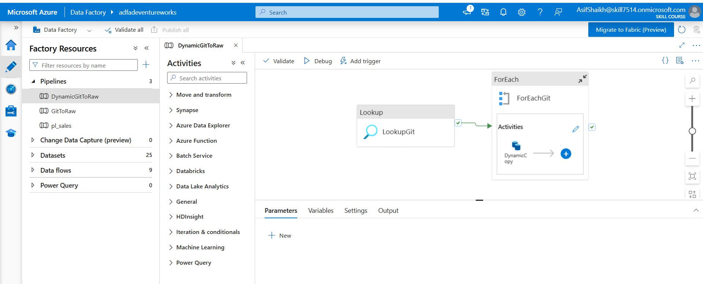
1. **Lookup Activity** — reads a JSON parameter file stored in ADLS containing `relative_url`, `sink_folder`, and `sink_file` values for each dataset
2. **ForEach Activity** — iterates over all rows returned by the Lookup
3. **Copy Activity (dynamic)** — inside the ForEach loop, copies each file from GitHub to the corresponding Bronze folder using dynamic parameters

**Parameters used:**
- `p_rel_url` — relative GitHub URL for the source file
- `p_sink_folder` — destination folder name in Bronze
- `p_sink_file` — destination file name in Bronze

**Parameter File:** [`git.json`](git.json/git.json)

**Pipeline Output:**

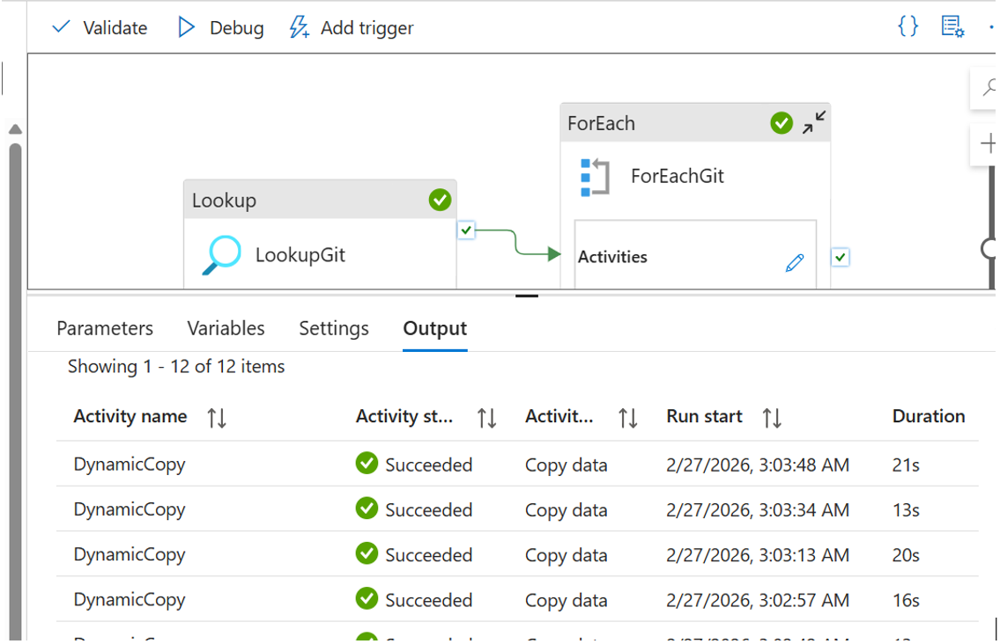


**Datasets ingested to Bronze:**

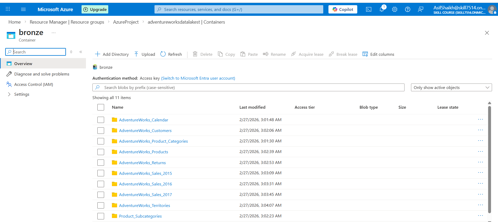

- AdventureWorks_Calendar
- AdventureWorks_Customers
- AdventureWorks_Product_Categories
- AdventureWorks_Product_SubCategories
- AdventureWorks_Products
- AdventureWorks_Returns
- AdventureWorks_Sales_2015
- AdventureWorks_Sales_2016
- AdventureWorks_Sales_2017
- AdventureWorks_Territories

---

## Data Transformation — Silver Layer

Transformations are implemented using **ADF Mapping Data Flows**, which run on Apache Spark clusters. Each Data Flow is wrapped inside a Pipeline and writes output in **Parquet format** to the Silver container.

### Transformation 1 — Calendar

**Data Flow:** `df_silver_calendar` | **Pipeline:** `pl_silver_calendar`

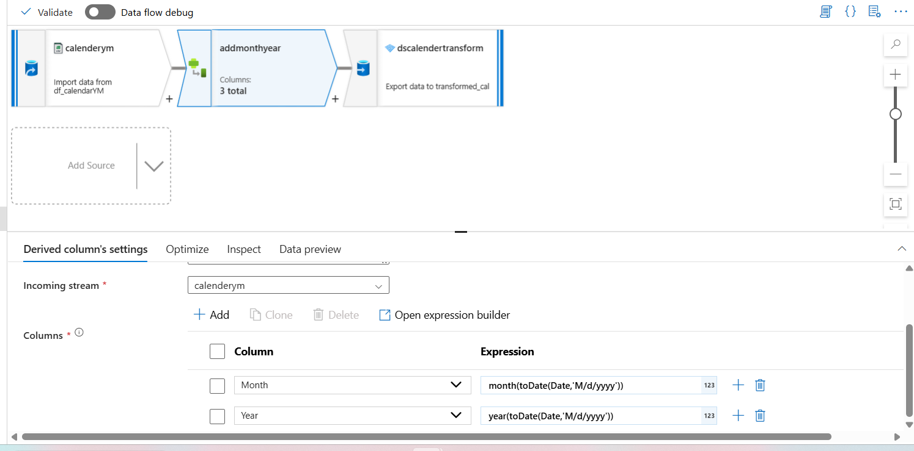

- Source: Bronze CSV
- Projection set to `string` to prevent date parsing failures (Spark default expects `yyyy-MM-dd`)
- **Derived Columns added:**
  - `Month`: `month(toDate(Date, 'M/d/yyyy'))`
  - `Year`: `year(toDate(Date, 'M/d/yyyy'))`

 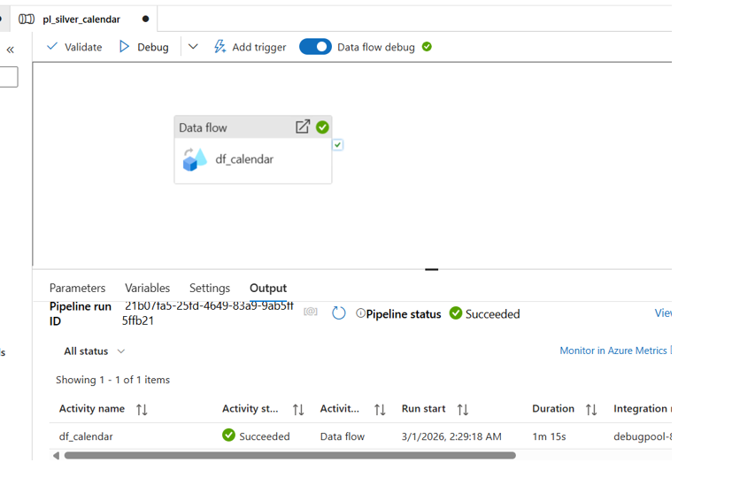
    
- Sink: Silver layer, Parquet format

 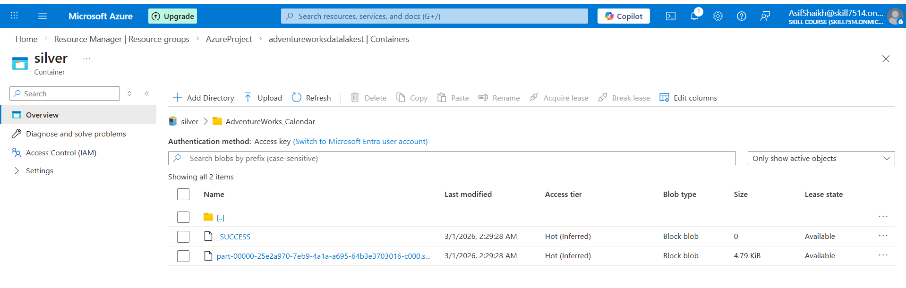

 

### Transformation 2 — Customers

**Data Flow:** `df_silver_customers`

- Source: Bronze CSV
- `BirthDate` column changed to `string` to prevent null values from auto type inference
- **Derived Column added:**
  - `FullName`: `trim(concat(Prefix, ' ', FirstName, ' ', LastName))` using `coalesce()` for null safety
- **Select transformation** applied to rename columns to camelCase (Parquet does not allow spaces or special characters in column names)

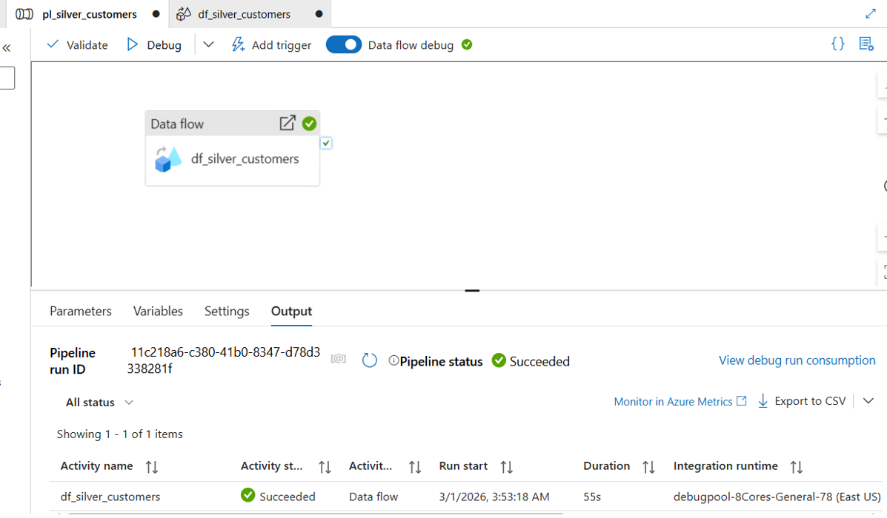
  
- Sink: Silver layer, Parquet format


### Transformation 3 — Product Categories

- Pass-through transformation: format conversion from CSV to Parquet

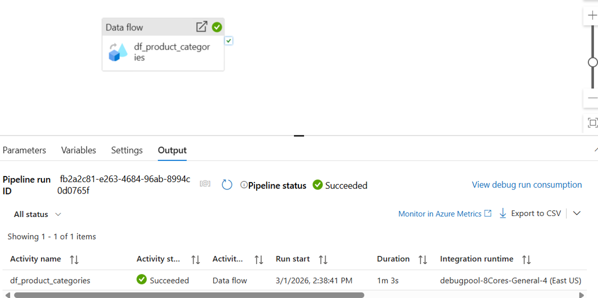
  
- No business transformations required

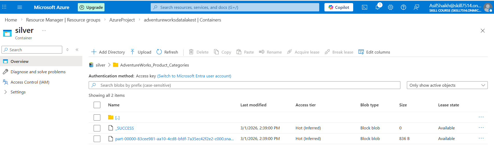


### Transformation 4 — Products

**Derived Column transformations (in-place overwrites):**

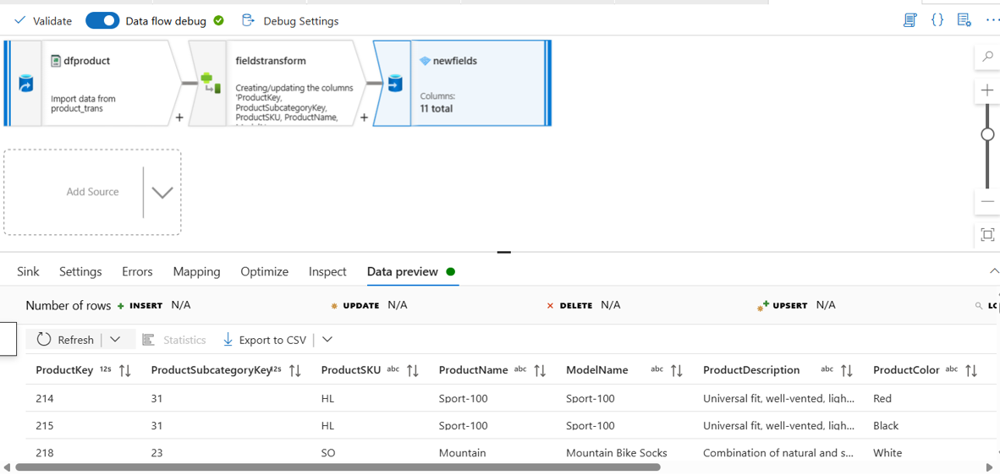

- **ProductSKU** — extract prefix before first hyphen:
  ```
  iif(locate('-', ProductSKU) > 0, substring(ProductSKU, 1, locate('-', ProductSKU) - 1), ProductSKU)
  ```
- **ProductName** — extract first word before space:
  ```
  iif(locate(' ', ProductName) > 0, substring(ProductName, 1, locate(' ', ProductName) - 1), ProductName)
  ```

  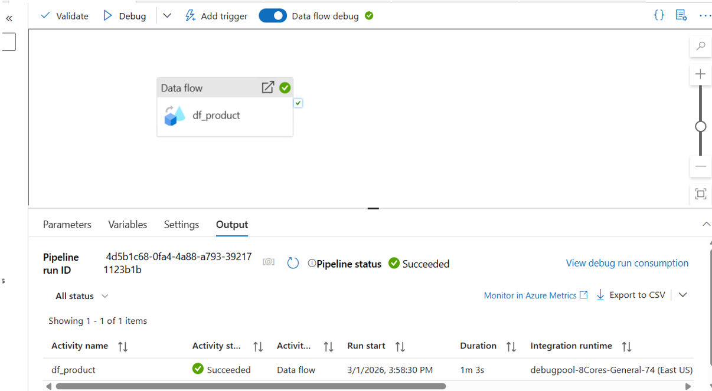

- Sink: Silver layer, Parquet format
  


### Transformation 5 — Returns

- Pass-through transformation: format conversion from CSV to Parquet

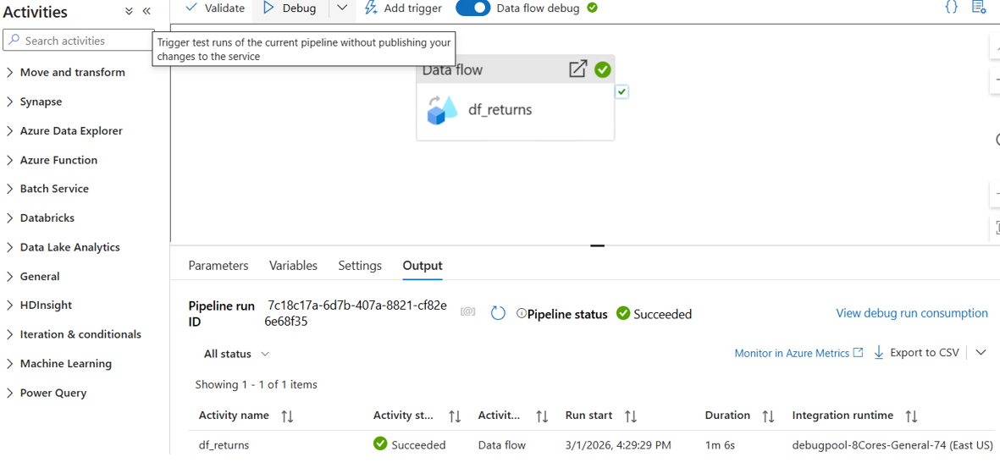

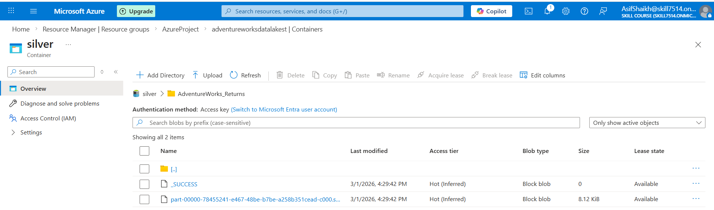

  

### Transformation 6 — Territories

- Pass-through transformation: format conversion from CSV to Parquet

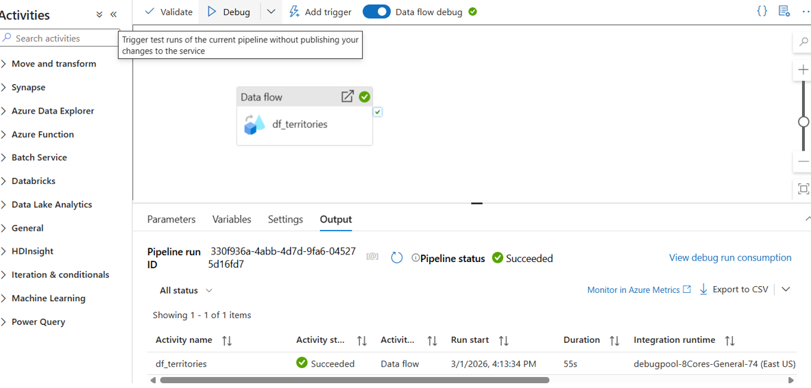

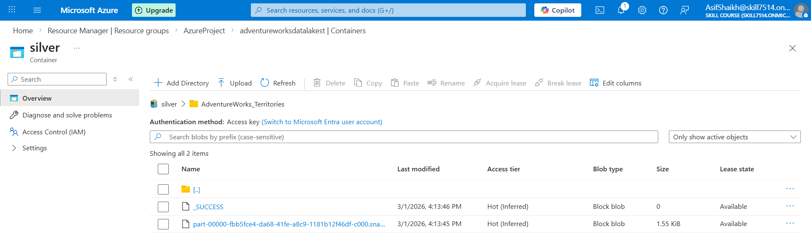


### Transformation 7 — Product Sub Categories

- Pass-through transformation: format conversion from CSV to Parquet

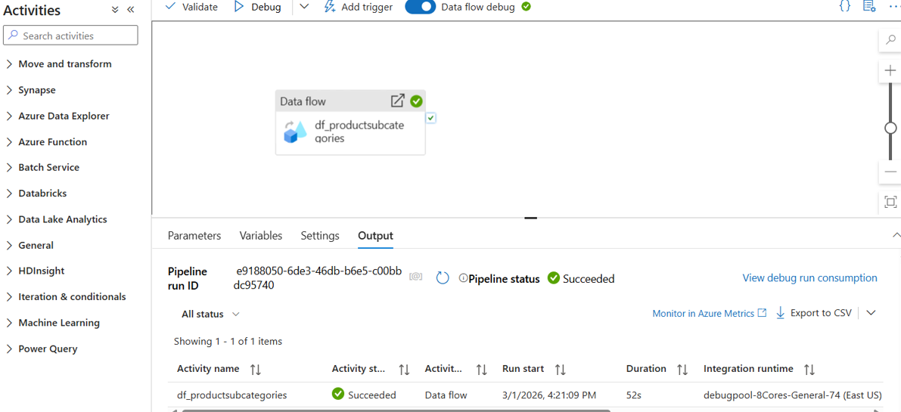

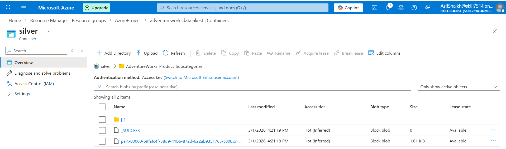


### Transformation 8 — Sales (2015, 2016, 2017)

All three yearly sales files are ingested in a single Data Flow using a **wildcard path** in Source Options:

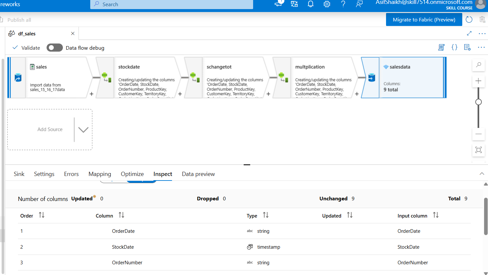

```
AdventureWorks_Sales_*/**/*.csv
```

This instructs ADF to recursively read all CSV files across matching folders, combining them into a single data stream.

**Transformations applied:**

| Transformation | Expression |
|---|---|
| StockDate → Timestamp | `toTimestamp(StockDate, 'MM/dd/yyyy')` |
| OrderNumber prefix S → T | `concat('T', substring(OrderNumber, 2))` |
| LineAmount (new column) | `OrderLineItem * OrderQuantity` |


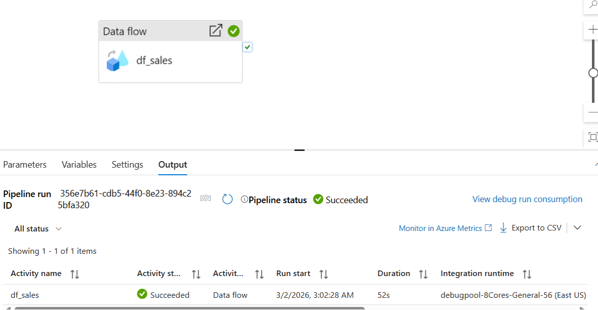


**Sink configuration:** Single Partition selected in Optimize tab to produce one consolidated Parquet file combining all three years.

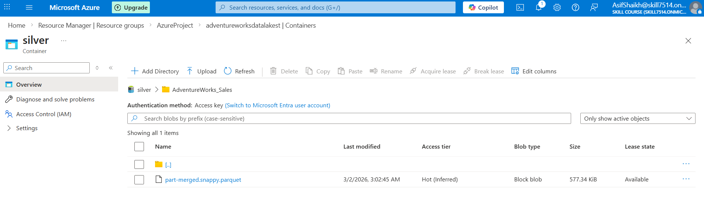

---

## Data Modeling — Gold Layer

The Gold layer is implemented in **Azure Synapse Analytics** using the Serverless SQL Pool.

### Synapse Workspace Setup

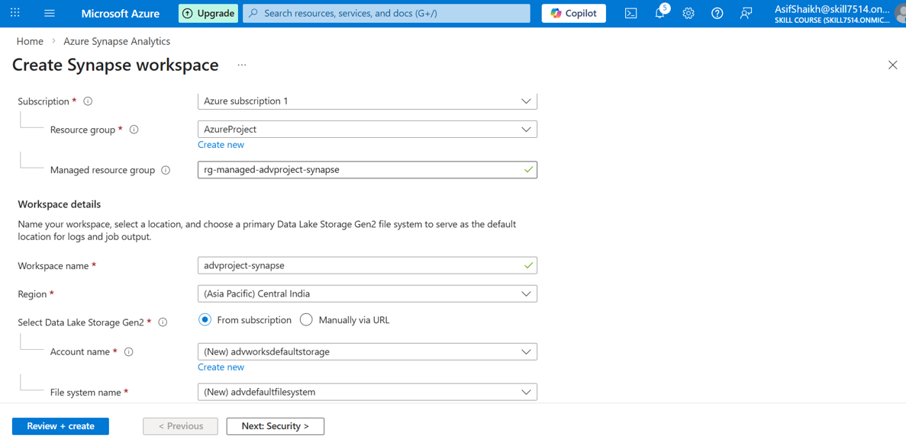

- **Workspace:** `advproject-synapse`
- **Default Storage:** `advworksdefaultstorage`
- **Database:** `advdatabase` (Serverless SQL Pool)

**Access configuration:**
- Synapse Managed Identity granted **Storage Blob Data Contributor** role on ADLS (for workspace-level access)
- User account granted **Storage Blob Data Contributor** role on ADLS (for OPENROWSET queries executed by the developer)

### Step 1 — Create Gold Schema

```sql
CREATE SCHEMA gold;
```

A dedicated schema provides logical separation between layers, improves governance, enables schema-level access control, and enforces clear architectural boundaries within the database.

### Step 2 — Create Views over Silver Layer

SQL views are created in the Gold schema using `OPENROWSET()` to logically expose Silver layer data as queryable SQL objects:

```sql
CREATE OR ALTER VIEW gold.calendar AS
SELECT *
FROM OPENROWSET(
    BULK 'https://adventureworksdatalakest.dfs.core.windows.net/silver/AdventureWorks_Calendar/',
    FORMAT = 'PARQUET'
) AS result;
```

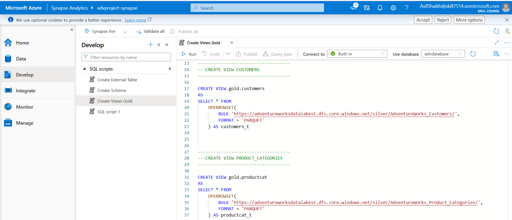


> **Note:** The `dfs.core.windows.net` endpoint is used instead of `blob.core.windows.net` because ADLS Gen2 with hierarchical namespace requires the Data Lake Storage (DFS) endpoint for proper integration with Synapse Serverless.

Views are created for all datasets: Calendar, Customers, Products, Product Categories, Product Sub Categories, Returns, Territories, and Sales.

### Step 3 — Create External Objects

To move from ad-hoc querying to a production-grade architecture, three external metadata objects are created:

**1. Master Key**
```sql
CREATE MASTER KEY ENCRYPTION BY PASSWORD = '<password>';
```

**2. Database Scoped Credential**
```sql
CREATE DATABASE SCOPED CREDENTIAL cred_asif
WITH IDENTITY = 'Managed Identity';
```
Uses Workspace Managed Identity — no storage keys or SAS tokens required.

**3. External Data Sources**
```sql
-- Silver (Read)
CREATE EXTERNAL DATA SOURCE source_silver
WITH (
    LOCATION = 'https://adventureworksdatalakest.dfs.core.windows.net/silver',
    CREDENTIAL = cred_asif
);

-- Gold (Write)
CREATE EXTERNAL DATA SOURCE source_gold
WITH (
    LOCATION = 'https://adventureworksdatalakest.dfs.core.windows.net/gold',
    CREDENTIAL = cred_asif
);
```

**4. External File Format**
```sql
CREATE EXTERNAL FILE FORMAT format_parquet
WITH (
    FORMAT_TYPE = PARQUET,
    DATA_COMPRESSION = 'org.apache.hadoop.io.compress.SnappyCodec'
);
```

### Step 4 — Materialize Gold Tables using CETAS

**CETAS (CREATE EXTERNAL TABLE AS SELECT)** physically writes curated data from the Silver layer into the Gold container in Parquet format and registers it as a queryable external table:

```sql
CREATE EXTERNAL TABLE gold.extsales
WITH (
    LOCATION = 'extsales/',
    DATA_SOURCE = source_gold,
    FILE_FORMAT = format_parquet
)
AS
SELECT * FROM gold.sales;
```

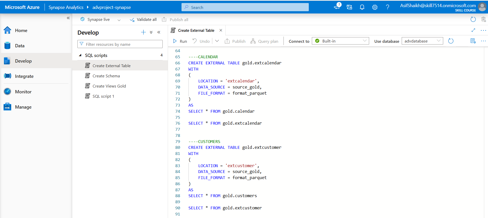


CETAS is executed for all datasets, resulting in physical Parquet files in the Gold container and registered external tables accessible via Synapse Serverless SQL.

**External tables created in Gold:**

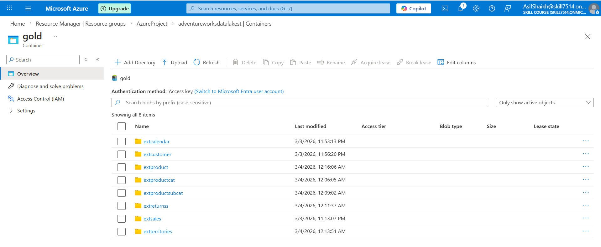

- `gold.extsales`
- `gold.extcustomers`
- `gold.extproducts`
- `gold.extcategories`
- `gold.extsubcategories`
- `gold.extreturns`
- `gold.extterritories`
- `gold.extcalendar`

---

## Data Model Summary

Power BI is connected to Synapse Serverless SQL using the SQL Serverless Endpoint.

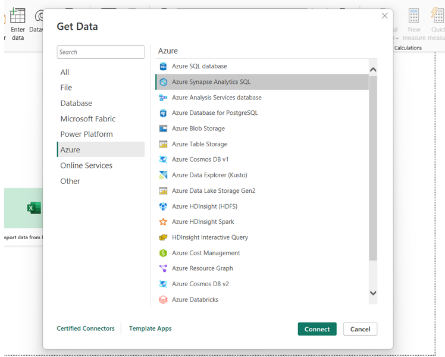

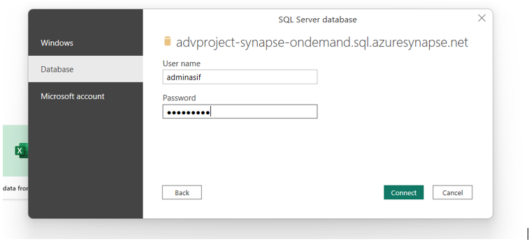

The data model follows a **Star Schema** design for optimized query performance and scalability.

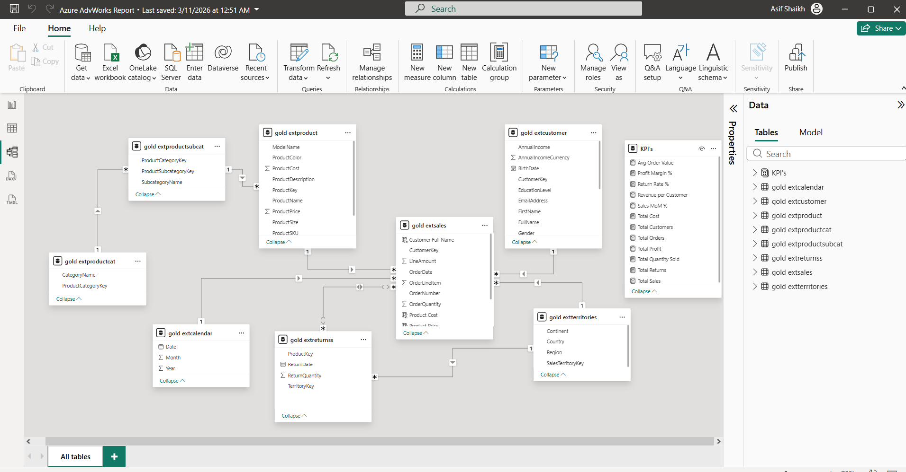


### Schema Design

| Type | Table | Description |
|---|---|---|
| Fact | `gold_extsales` | Main transactional sales data |
| Fact | `gold_extreturns` | Product return transactions |
| Dimension | `gold_extcustomers` | Customer demographics |
| Dimension | `gold_extproducts` | Product details |
| Dimension | `gold_extcalendar` | Date/time attributes |
| Dimension | `gold_extcategories` | Product category hierarchy |
| Dimension | `gold_extsubcategories` | Product subcategory hierarchy |
| Dimension | `gold_extterritories` | Geographic regions |

### Relationships

- One-to-Many relationships between all dimension tables and the Sales fact table
- Returns table connected separately via Product and Territory dimensions
- A dedicated **KPI Measures table** is created in Power BI containing DAX measures:
  - Total Sales
  - Profit Margin %
  - Return Rate %
  - Total Orders
  - Revenue per Customer
  - Sales MoM %

---

## Power BI Dashboard

The dashboard consists of three report pages, each targeting a specific analytical perspective.

### Page 1 — Executive Overview

Provides a high-level summary of overall business performance.

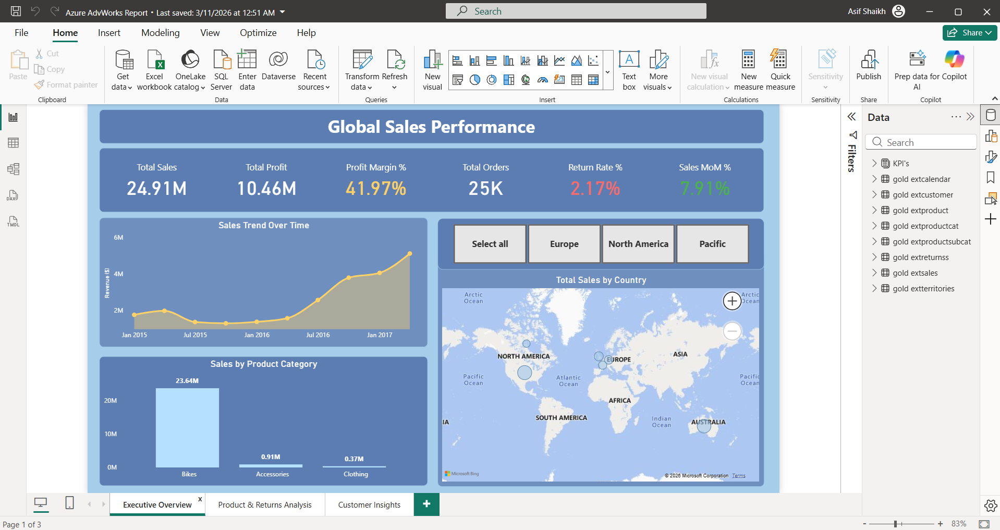

**Visuals included:**
- KPI cards: Total Sales, Profit, Profit Margin %, Total Orders, Return Rate %, Sales MoM %
- Sales Trend Line Chart — tracks performance over time and identifies growth patterns
- Region Slicer + Map Visual — geographic distribution of sales
- Product Category Bar Chart — top and low-performing categories

**Use case:** Quick snapshot for executive decision-making, monitoring profitability and growth trends.

### Page 2 — Product & Returns Analysis

Focuses on product-level performance and return behaviour.

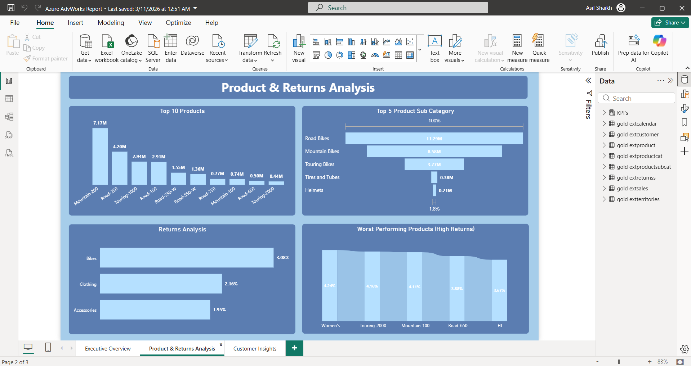

**Visuals included:**
- Top 10 Products by Revenue — best-selling products
- Top 5 Product Subcategories — highest revenue-contributing subcategories
- Returns Analysis by Category — return rate across product categories
- Worst Performing Products — products with high return rates indicating quality issues

**Use case:** Identifying revenue-driving and high-risk products to support inventory and quality decisions.

### Page 3 — Customer Insights

Focuses on customer segmentation and revenue contribution.

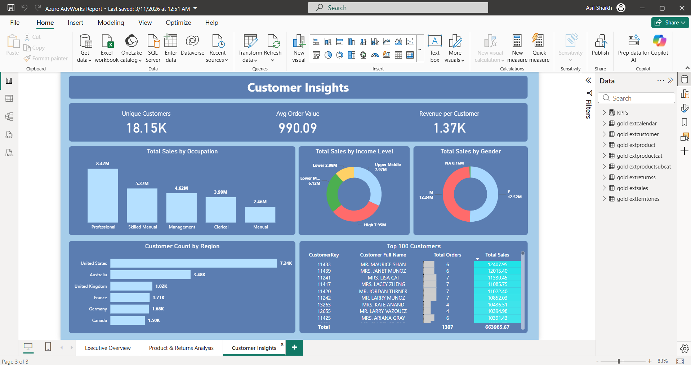

**Visuals included:**
- KPI cards: Total Unique Customers, Average Order Value, Revenue per Customer
- Sales by Occupation
- Sales by Income Level
- Sales by Gender
- Customer Count by Region
- Top 100 Customers Table — ranked by Total Orders and Total Sales

**Use case:** Understanding customer demographics and identifying high-value segments for targeted marketing.

---

## Key Insights

- **Medallion Architecture** enforces clear separation of raw, cleansed, and serving data layers, improving data governance and pipeline maintainability.
- **Dynamic, parameterised pipelines** in ADF avoid redundant copy activities and scale to any number of source datasets through metadata-driven design.
- **Parquet format with Snappy compression** in Silver and Gold layers delivers significantly better read performance and storage efficiency compared to CSV.
- **External Tables via CETAS** physically materialize Gold layer data, decoupling downstream reporting from Silver layer read latency.
- **Star Schema** in Power BI enables efficient DAX calculations, fast query performance, and intuitive relationship navigation for business users.
- **Managed Identity authentication** throughout the pipeline eliminates hardcoded credentials and follows Azure security best practices.

---

*Built with Azure Data Factory · Azure Data Lake Storage Gen2 · Azure Synapse Analytics · Power BI*

